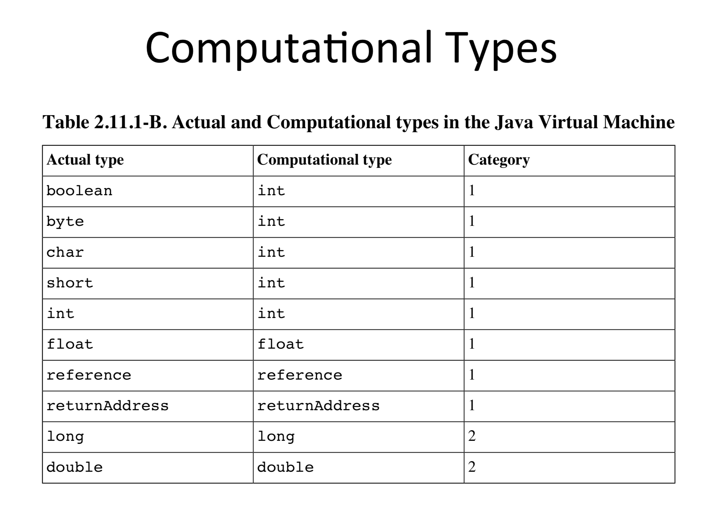

# Exercise 2
Check the differences between files `StrangeOne.java` and `StrangeTwo.java`. Compile them, disassemble the obtained classes using `javap -c` and inspect the byte-code of the method sum. Is the byte-code the same? Can you explain why?

**Goal**: Using `javap` for disassembling Java code; inspecting simple bytecodes.

**Expected output**: One short sentence answering the two questions.

# Analysis

## Disassembled bytecode

Compiled from "StrangeOne.java"
```
class StrangeOne {
  int b0;

  int b1;

  StrangeOne();
    Code:
       0: aload_0
       1: invokespecial #1                  // Method java/lang/Object."<init>":()V
       4: aload_0
       5: bipush        42
       7: putfield      #2                  // Field b0:I
      10: aload_0
      11: bipush        42
      13: putfield      #3                  // Field b1:I
      16: return

  int sum();
    Code:
       0: aload_0
       1: getfield      #2                  // Field b0:I
       4: aload_0
       5: getfield      #3                  // Field b1:I
       8: iadd
       9: ireturn
}
```

Compiled from "StrangeTwo.java"
```
class StrangeTwo {
  byte b0;

  byte b1;

  StrangeTwo();
    Code:
       0: aload_0
       1: invokespecial #1                  // Method java/lang/Object."<init>":()V
       4: aload_0
       5: bipush        42
       7: putfield      #2                  // Field b0:B
      10: aload_0
      11: bipush        42
      13: putfield      #3                  // Field b1:B
      16: return

  int sum();
    Code:
       0: aload_0
       1: getfield      #2                  // Field b0:B
       4: aload_0
       5: getfield      #3                  // Field b1:B
       8: iadd
       9: ireturn
}
```

The difference is the type of `b0` and `b1` vars. In the first class their type is `int` while in the second their type is `byte`. But since op-codes are bytes, there are at most 256 distinct ones, hence:
- Impossible to have for each instruction one opcode per type
- Careful selection of which types to support for each instruction
- Non-supported types have to be converted
-  Result: non-orthogonality of the instruction Set Architecture

Design choice in JVM: almost no support for `byte`, `char` and `short` – using int as “computational type”.



*From [http://pages.di.unipi.it/corradini/Didattica/AP-18/SLIDES/AP-2018-06.pdf](http://pages.di.unipi.it/corradini/Didattica/AP-18/SLIDES/AP-2018-06.pdf)*.