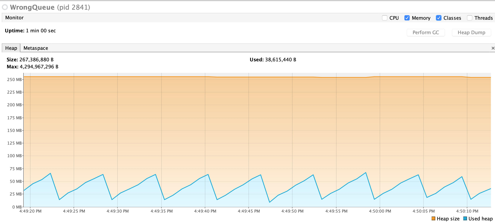

# Analysis

The the original code the `current` var in `dequeue()` keeps linked to the previous node and it never gets garbage-collected. So we explicitly remove the useless link to permit GC.

The heap usage of the new implementation