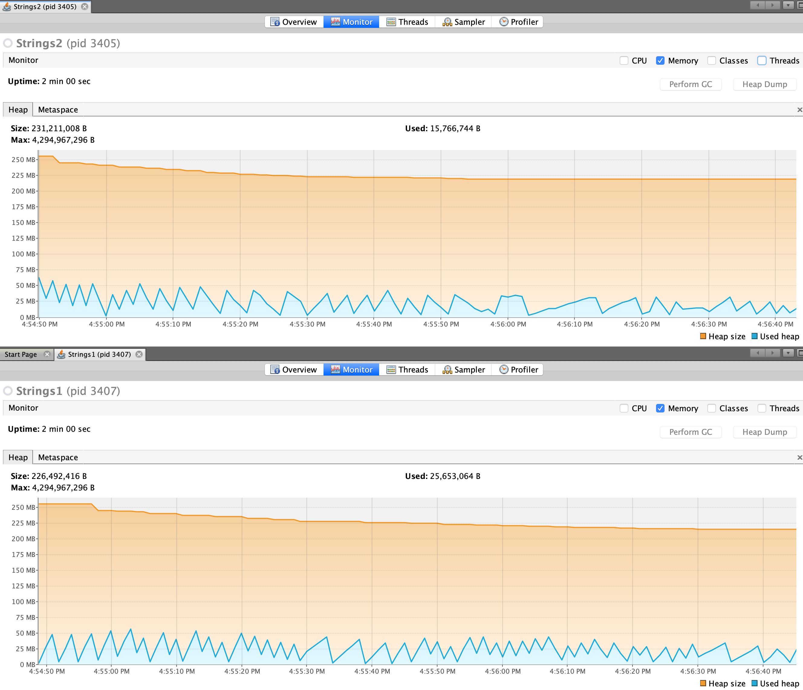

# Analysis

The `String1` does not allocate a new heap cell for each string printed in the loop, while the `Strings2` does (strings are immutable, a concatenation results in a new string allocation). In any case the memory distribution remains almost the same thanks to garbage collector that de-allocates the used string after a while.

The heap usage of the two approaches.