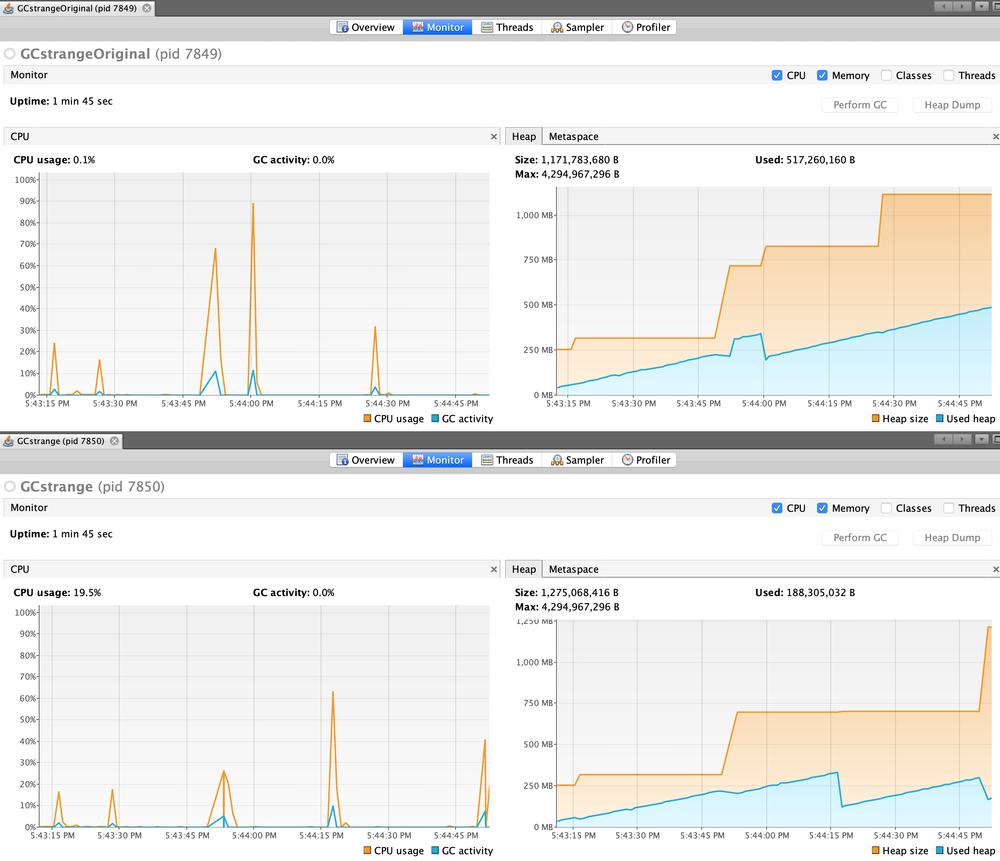
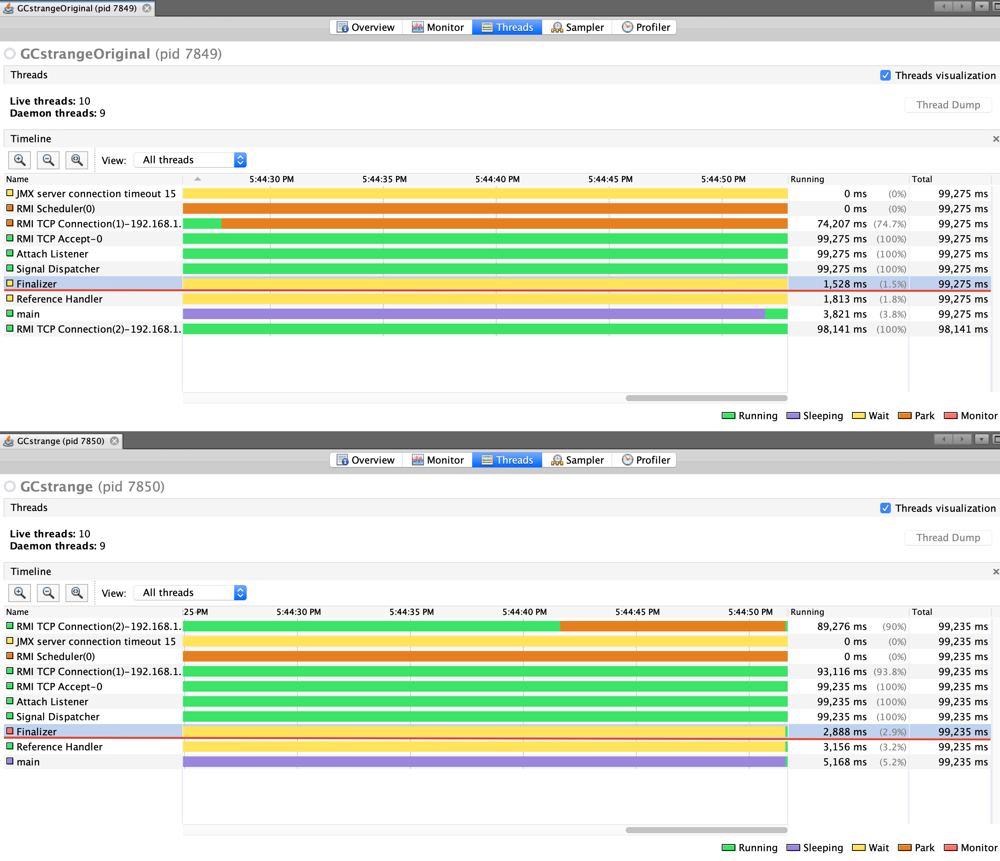

# Exercise 5
Run and inspect the program `GCstrange` using `visualvm`, in particular check the evolution of the heap, the activity of the `GC` and the activity of the `Finalizer` thread. Using `GCstrange` as a template, write a simple class that overrides the method finalize in order to count how many times the garbage collector is invoked. Write a main to test this class.

**Goal**: Understanding the finalization of objects in Java; exploiting the finalize method to infer simple properties of garbage collection.

**Expected output**: A clear explanation of why the occupation of the memory increases during execution of the given program; a working Java program implementing the given specification.

# Analysis

The `finalize()` method, called by garbage collector insert the current instance into a static linked list, saved in the non-heap memory of the JVM. In this case the GC can not delete the object since its reference is saved in a per-thread shared memory area. To properly count the numbers of `finalize()` calls, instead of inserting the current instance, simply increment a shared counter.

## Memory usage
The above plot refers to the original source code, with the insertion of the current instance in a linked list by the `finalize()` method, while the bottom plot refers to the modified code with the increment of a interger variable inside the `finalize()`. In the bottom we can see the garbage collector de-allocating memory (the descending peaks in the middle and at the end).

## Finalizer thread

Here we can see that the finalize thread has been active twice the time in the second implementation rather than the first (`2,888ms` vs `1,528ms`).

