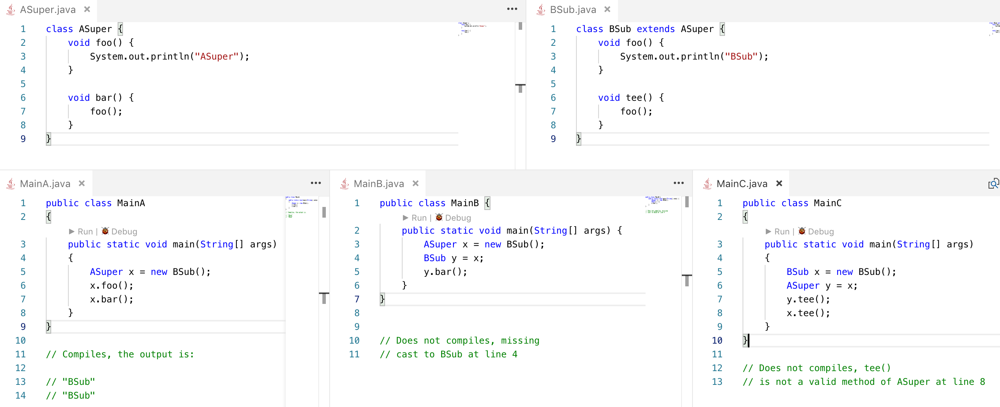

# Exercise 6
The classes `ASuper` and `BSub` are those of the second question of the Entry Test. Consider the files `MainA.java`, `MainB.java` and `MainC.java`: just by inspecting their code, can you say for each of them if it compiles or not? If yes, can you predict what the code prints in each case? Verify your guesses by actually compiling and executing the code.

**Goal**: Most students provided only partly correct answers to the second question of the entry test. This exercise gives them the possibility of checking their answers.

# Analysis

